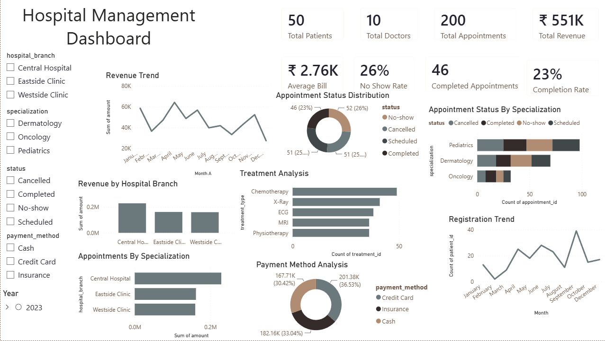

# Hospital_Management_Dashboard
Interactive Power BI dashboard for analyzing hospital operations, appointments, treatments, revenue, and patient registrations.
# 🏥 Hospital Management Dashboard

## 📌 Project Overview

This project is an interactive Power BI dashboard developed to analyze hospital operations, appointments, revenue, treatments, and patient registrations.

The dashboard helps monitor hospital performance using KPIs, interactive filters, and business insights.

---

## 📊 Dashboard Preview

---

## 🎯 Objectives

- Monitor hospital revenue
- Analyze appointment status
- Track patient registrations
- Compare hospital branches
- Analyze treatment distribution
- Evaluate payment methods

---

## 📈 Key KPIs

- Total Patients
- Total Doctors
- Total Appointments
- Total Revenue
- Average Bill
- Completion Rate
- No-show Rate

---

## 📊 Dashboard Features

- Revenue Trend
- Revenue by Hospital Branch
- Appointment Status Distribution
- Appointment Status by Specialization
- Treatment Analysis
- Registration Trend
- Payment Method Analysis

---

## 🛠 Tools Used

- Power BI
- Power Query
- DAX
- Data Modeling
- Excel

---

## 📂 Data Model

- Patients
- Doctors
- Appointments
- Treatments
- Billing

Relationships were created using One-to-Many data modeling.

---

## 📌 Skills Demonstrated

- Data Cleaning
- Data Modeling
- DAX Measures
- KPI Design
- Interactive Dashboard Development
- Business Analysis

---

## 📁 Files Included

- Power BI Dashboard (.pbix)
- Dashboard Screenshot
- Project Presentation (PDF)
- Dataset (if applicable)
